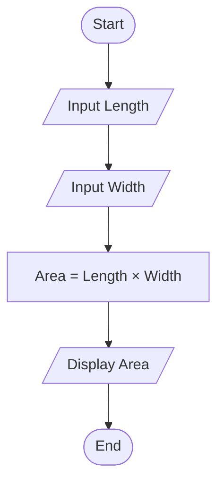
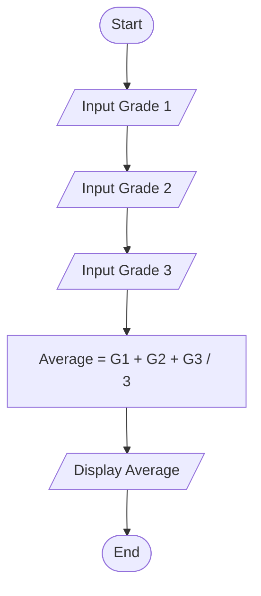

```mermaid
flowchart TD
    A([Start]) --> B[/Input Number/]
    B --> C {Number > 0?}
    C -- Yes --> D[Display "Positive"]
    C -- No --> E{Number < 0?}
    E -- Yes --> F[Display "Negative"]
    E -- No --> G[Display "Zero"]
    D --> H([End])
    F --> H
    G --> H
```


